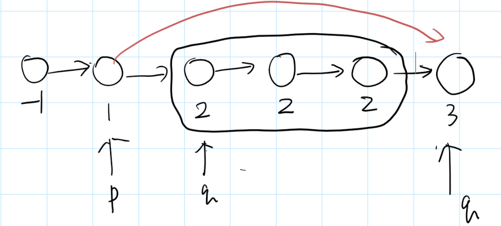

# ! 面试题11：旋转数组中最小数字

yxc：二分不一定要有单调性，二分的本质是寻找某种性质的分界点。只要可以找到某种性质，使得区间的前半部分满足，后半部分不满足，那么就可以用二分把这个分界点找到。

本题中最重要的就是前段升序序列大于等于nums[0]，后段升序序列应该小于nums[0]，但是存在等于的，可以提前处理掉。由于需要处理后面这个相等的平台，导致时间复杂度为O(n)，但如果不存在这种情况时间复杂度为O(nlogn)。

[AcWing 22. 旋转数组的最小数字 - AcWing](https://www.acwing.com/solution/content/727/)


```c++
//yxc版标准二分！赞 ！
class Solution {
public:
    int findMin(vector<int>& nums) {
        int n = nums.size() - 1;
        while(n > 0 && nums[0] == nums[n]) n--;
        if(n < 0) return -1;
        if(nums[n] >= nums[0]) return nums[0];
        //删完重复后,只剩下第一个升序序列了
        int l = 0, r = n;
        while(l < r)
        {
            int mid = l + r >> 1;
            if(nums[mid] >= nums[0])
                l = mid + 1;
            else
                r = mid;
        }
        return nums[l];
    }
};
```

# 面试题12：矩阵中的路径

简单回溯

```c++
class Solution {
public:
    int dx[4] = {-1, 1, 0, 0};
    int dy[4] = {0, 0, -1, 1};
    bool dfs(int i, int j, int l, vector<vector<char>>& matrix, string & str)
    {
        if(l == str.size())
            return true;
        if(str[l] == matrix[i][j])
        {
            matrix[i][j] = '.';
            for(int k = 0; k < 4; k++)
            {
                int x = i + dx[k], y = j + dy[k];
                if(x < matrix.size() && x >= 0 && y < matrix[0].size() && y >= 0 && dfs(x, y, l + 1, matrix, str))
                    return true;
            }
            matrix[i][j] = str[0];
        }
        return false;
        
    }
    bool hasPath(vector<vector<char>>& matrix, string &str) {
        int l = 0;
        for(int i = 0; i < matrix.size(); i++)
        {
            for(int j = 0; j < matrix[0].size(); j++)
            {
                if(matrix[i][j] == str[l])
                {
                    if(str.size() == 1)
                        return true;
                    matrix[i][j] = '.';
                    for(int k = 0; k < 4; k++)
                    {
                        int x = i + dx[k], y = j + dy[k];
                        if(x < matrix.size() && x >= 0 && y < matrix[0].size() && y >= 0 && dfs(x, y, l + 1, matrix, str))
                            return true;
                    }
                    matrix[i][j] = str[l];
                }
            }
        }
        return false;
        
    }
};
```

可以改进成从0开始！

```c++
class Solution {
public:
    int dx[4] = {-1, 1, 0, 0};
    int dy[4] = {0, 0, -1, 1};
    bool dfs(int i, int j, int l, vector<vector<char>>& matrix, string & str)
    {
        if(str[l] != matrix[i][j])
            return false;
        if(l == str.size() - 1)
            return true;
        matrix[i][j] = '.';
        for(int k = 0; k < 4; k++)
        {
            int x = i + dx[k], y = j + dy[k];
            if(x < matrix.size() && x >= 0 && y < matrix[0].size() && y >= 0 && dfs(x, y, l + 1, matrix, str))
                return true;
        }
        matrix[i][j] = str[l];
        return false;
    }
    bool hasPath(vector<vector<char>>& matrix, string &str) {
        int l = 0;
        for(int i = 0; i < matrix.size(); i++)
        {
            for(int j = 0; j < matrix[0].size(); j++)
            {
                if(dfs(i, j, l, matrix, str))
                    return true;
            }
        }
        return false;
        
    }
};
```

# 面试题13：机器人的运动范围

简单dfs

```c++
class Solution {
public:
    int dx[4] = {-1, 1, 0, 0};
    int dy[4] = {0, 0, -1, 1};
    int thr, r, c;
    bool check(int x, int y)
    {
        int s = 0;
        while(x)
        {
            s += x % 10;
            x = x / 10;
        }
        while(y)
        {
            s += y % 10;
            y = y / 10;
        }
        if(s <= thr)
            return true;
        return false;
    }
    void dfs(int i, int j, int& ans, vector<vector<bool>>& st)
    {
        if(st[i][j] == true)
            return ;
        st[i][j] = true;
        ans++;
        for(int k = 0; k < 4; k++)
        {
            int x = i + dx[k], y = j + dy[k];
            if(x >= 0 && x < r && y >= 0 && y < c && check(x, y))
                dfs(x, y, ans, st);
        }
    }
    int movingCount(int threshold, int rows, int cols)
    {
        thr = threshold;
        r = rows;
        c = cols;
        if(r == 0 && c == 0)
            return 0;
        vector<vector<bool>> st(rows, vector<bool>(cols, false));
        int ans = 0;
        dfs(0, 0, ans, st);
        return ans;
    }
};
```

# 面试题15：二进制中的1的个数

```c++
class Solution {
public:
    int NumberOf1(int n) {
        int ans = 0;
        while(n)
        {
            if(n & 1)
                ans++;
            n = n >> 1;
        }
        return ans;
    }
};
```

上面这种无法处理负数，如-1=0xFFFFFFFF，有32个1。每次右移会在最高位补1，保证是负数，那就导致永远存在1，死循环了。

解决方法是强制将n变成无符号整数，存储还是补码，但是解释不同，这样右移就是逻辑右移，在最高位补0。

```c++
class Solution {
public:
    int NumberOf1(int n) {
        int ans = 0;
        unsigned int un = n;
        while(un)
        {
            if(un & 1)
                ans++;
            un = un >> 1;
        }
        return ans;
    }
};
```

另一个方法，就是将1不断循环左移，最多32次就会将1移出去变成0，然后就会结束循环。

```c++
class Solution {
public:
    int NumberOf1(int n) {
        int ans = 0, b = 1;
        while(b)
        {
            if(n & b)
                ans++;
            b = b << 1;
        }
        return ans;
    }
};
```

**经典：将某个二进制最右侧1清零** like n = 1100, n -1 = 1011，就是最右侧1变0，1后面0变1，n & n -1 = 1000

```c++
class Solution {
public:
    int NumberOf1(int n) {
        int ans = 0;
        while(n)
        {
            ans++;//统计多少次
            n = n & (n - 1);//将某个二进制最右侧1清零
        }
        return ans;
    }
};
```

# 面试题16：数值的整数次方

快速幂

```c++
int qkm(int a, int k, int p) //a^k % p
    {
        long long ans;
        while(k)
        {
            if(k & 1)
                ans = (long long) ans * a % p;
                
            k = k >> 1;
            a = (long long) a * a % p;
            return ans;
        }
    }
```

```c++
class Solution {
public:
    double Power(double b, int e) {
        int s = 0;
        long long ue;
        if(e < 0) 
        {
            s = 1;
            ue = -(long long)e;
            //e如果是负无穷取负会导致int越界
        }
        else
            ue = e;
        double ans = 1;
        while(ue)
        {
            if(ue & 1)
                ans *= b;
            ue = ue >> 1;
            b = b * b;
        }
        if(s)
            ans = 1.0 / ans;
        return ans;
    }
    
};
```

# 面试题18：删除链表的节点

单链表删除一个节点通常需要遍历该链表找到链表的前一个节点，这就需要O(n)。但是现在要求O(1)的复杂度，因为给出了当前要删除的链表节点，所以可以将后面那个节点的值复制到要删除的，然后将要删除的下一个指向下下一个。

```c++
class Solution {
public:
    void deleteNode(ListNode* node) {
        ListNode* nodeNext = node->next;
        node->val = nodeNext->val;
        node->next = nodeNext->next;
        delete nodeNext;
    }
};
```

如果是尾节点还是需要从头遍历的！

# 删除链表重复节点



双指针，p指向上一个已完成的节点，q从p的下一个开始查找重复节点，直到和p->next->val不同，停止。如果p->next->next== q那就是不重复，因为p-next q 这两个不一样，但是如果不等就是有重复的，那就p直接指向和p->next不一样的q就可以了。

# 面试题21：调整数组顺序使奇数位于偶数前面

类似于快排，就是两个指针，l和r。l左侧的都是奇数，r右侧的都是偶数。如果碰见不是的，那就交换。

```c++
class Solution {
public:
    void reOrderArray(vector<int> &array) {
        int l = 0, r = array.size() - 1;
        while(l < r)
        {
            while(l < r && array[l] % 2 == 1) l++;
            while(l < r && array[r] % 2 == 0) r--;
            if(l < r) swap(array[l], array[r]);
        }
        
    }
};
```

# 面试题22：链表中倒数第K个节点

我用栈做的哈哈哈哈，终于记起stack了！复杂度是O(n + k)。当然也可以是遍历两边，第一遍找出长度，第二遍找到第n-k个。

```c++
class Solution {
public:
    ListNode* findKthToTail(ListNode* pListHead, int k) {
        stack<ListNode* > s;
        int n = 0;
        ListNode* p = pListHead;
        while(p != nullptr)
        {
            s.push(p);
            p = p->next;
            n++;
        }
        if(k > n)
            return nullptr;
        while(k--)
        {
            p = s.top();
            s.pop();
        }
        return p;
    }
};
```

快慢指针做法，就是快指针先走k-1，然后慢指针走。等快指针走到了n，慢指针也就是倒数第k个了。

重点就是相差k-1个！！！

```c++

 *class Solution {
public:
    ListNode* findKthToTail(ListNode* pListHead, int k) {
        ListNode *q = pListHead, *s = pListHead;
        while(k--)
        {
            if(q != nullptr)
                q = q->next;
            else
                return nullptr;
        }
        while(q != nullptr)
        {
            q = q->next;
            s = s->next;
        }
        return s;
    }
};
```

# 面试题23：链表中环的入口节点

首先判断链表中是否包含环？

方法一：哈希表

入口点就是第一个出现重复的节点

unordered_set.find(x) != end();

unordered_set.count(x) 是否存在x,存在返回1,不存在返回0

```c++
class Solution {
public:
    ListNode *entryNodeOfLoop(ListNode *head) {
        unordered_set<ListNode*> hashset;
        ListNode* p = head;
        while(p)
        {
            if(hashset.find(p) != hashset.end())
            //if(hashset.count(p))
                return p;
            else
                hashset.insert(p);
            p = p->next;
        }
        return 0;
    }
};
```

方法二：快慢指针

快指针一次走两步，慢指针一次走一步，如果相遇就是存在环。相遇之后将first指向head，慢指针不动，继续一次走一步，再次相遇就是入口点。


```c++
class Solution {
public:
    ListNode *entryNodeOfLoop(ListNode *head) {
        ListNode *first = head, *second = head;
        while(second && first)
        {
            first = first->next;
            second = second->next;
            if(second)
                second = second->next;
            if(second && second == first) //遇到了肯定是存在环
            {
                first = head;
                while(first != second)
                {
                    first = first->next;
                    second = second->next;
                }
                return first;
            }
        }
        return NULL;
    }
};
```

**制造两个指针之前差为n的距离。**

那就得先直到环上节点数，是否存在环，也就是上述的两个方法。


# 面试题25：合并两个有序链表

```c++
class Solution {
public:
    ListNode* merge(ListNode* l1, ListNode* l2) {
        ListNode* dummy = new ListNode(-1);
        ListNode* p = dummy;
        while(l1 != NULL && l2 != NULL)
        {
            if(l1->val <= l2->val)
            {
                p->next = l1;
                l1 = l1->next;
                p = p->next;
            }
            else
            {
                p->next = l2;
                l2 = l2->next;
                p = p->next;
            }
        }
        if(l1 != NULL)
            p->next = l1;
        if(l2 != NULL)
            p->next = l2;
        return dummy->next;
    }
};
```

递归版：

```c++
class Solution {
public:
    ListNode* merge(ListNode* l1, ListNode* l2) {
        if(l1 == nullptr)
            return l2;
        if(l2 == nullptr)
            return l1;
            
        ListNode* p = nullptr;
        if(l1->val < l2->val)
        {
            p = l1;
            p->next = merge(l1->next, l2);
        }
        else
        {
            p = l2;
            p->next = merge(l1, l2->next);
        }
        return p;
    }
};
```

# 面试题26：判断树的子结构

```c++
class Solution {
public:
    bool isSame(TreeNode* pRoot1, TreeNode* pRoot2){
        if(pRoot2 == nullptr)//root2匹配完成
            return true;
        if(pRoot1 == nullptr)//root2没完但是root1已经完成了
            return false;
            
        if(pRoot1->val != pRoot2->val)
            return false;
        return isSame(pRoot1->left, pRoot2->left) && isSame(pRoot1->right, pRoot2->right);
    }
    bool hasSubtree(TreeNode* pRoot1, TreeNode* pRoot2) {
        if(pRoot2 == nullptr || pRoot1 == nullptr)//空树不是任何树的子树
            return false;
            
        if(isSame(pRoot1, pRoot2)) //比较以proot1为根节点的子树是否和proot2匹配
            return true;
        else
            return hasSubtree(pRoot1->left, pRoot2) || hasSubtree(pRoot1->right, pRoot2);
    }
};
```

# 面试题27：二叉树的镜像

```c++
class Solution {
public:
    void mirror(TreeNode* root) {
        if(root == nullptr)
            return;
        TreeNode* tmp = root->right;
        root->right = root->left;
        root->left =  tmp;
        //swap(root->left, root->right);
        
        mirror(root->left);
        mirror(root->right);
    }
};
```

# 面试题28：对称的二叉树

```c++
class Solution {
public:
    bool isSymmetric(TreeNode* root) {
        return isSymmetric(root, root);
    }
    bool isSymmetric(TreeNode* rootL, TreeNode* rootR)
    {
        if(rootR == nullptr && rootL == nullptr)
            return true;
        if(rootL == nullptr || rootR == nullptr)
            return false;
        if(rootL->val != rootR->val)
            return false;
        return isSymmetric(rootL->left, rootR->right) && isSymmetric(rootL->right, rootR->left);
    }
};
```

# 面试题29：顺时针打印矩阵

```c++
class Solution {
public:
    vector<int> printMatrix(vector<vector<int> > matrix) {
        if(matrix.empty()) return {};
        int m = matrix.size(), n = matrix[0].size();
        vector<int> ans;
        vector<vector<bool>> st(m, vector<bool>(n, false));
        int x = 0, y = 0, d = 1;//从(0, 0)开始,初始方向为向右
        int dx[4] = {-1, 0, 1, 0}, dy[4] = {0, 1, 0, -1};//顺时针上右下左
        for(int i = 0; i < m * n; i++)
        {
            ans.push_back(matrix[x][y]);
            st[x][y] = true;
            
            int a = x + dx[d], b = y + dy[d];//下一个
            if(a >= m || a < 0 || b >= n || b < 0 || st[a][b])//越界了或者访问过了就换一个方向
            {
                d = (d + 1) % 4;
                a = x + dx[d];
                b = y + dy[d];
            }
            x = a;
            y = b;
        }
        return ans;
    }
};
```

# 面试题30：包含min函数的栈

添加一个保存当前最小函数的辅助栈即可

```c++
class MinStack {
public:
    stack<int> sdata, smin;
    MinStack() {
        while(sdata.size())
            sdata.pop();
            
        while(smin.size())
            smin.pop();
    }
    
    void push(int x) {
        sdata.push(x);
        if(smin.size() == 0)
            smin.push(x);
        else
        {
            int t = smin.top();
            if(x < t)
                smin.push(x);
            else
                smin.push(t);
        }
    }
    
    void pop() {
        sdata.pop();
        smin.pop();
    }
    
    int top() {
        return sdata.top();
    }
    
    int getMin() {
        return smin.top();
    }
};
```

# 面试题31：栈的压入、弹出序列

压入一个值，就看看能否按照popV序列pop出一些东西来。如果最后栈中还有值，说明序列没有匹配上。

```c++
class Solution {
public:
    bool isPopOrder(vector<int> pushV,vector<int> popV) {
        if(pushV.empty() && popV.empty()) 
            return true;
        if(pushV.size() == 0 || popV.size() == 0 || pushV.size() != popV.size())
            return false;
        stack<int> s;
        int j = 0;
        for(int i = 0; i < pushV.size(); i++)
        {
            s.push(pushV[i]);
            while(s.size() && s.top() == popV[j])
            {
                s.pop();
                j++;
            }
        }
        return s.empty();
    }
};
```

# 面试题32：从上到下打印二叉树

简单层序遍历

```c++
class Solution {
public:
    vector<int> printFromTopToBottom(TreeNode* root) {
        if(root == nullptr)
            return {};
        queue<TreeNode*> q;
        vector<int> ans;
        q.push(root);
        while(q.size())
        {
            TreeNode* t = q.front();
            q.pop();
            ans.push_back(t->val);
            
            if(t->left != nullptr)
                q.push(t->left);
            if(t->right != nullptr)
                q.push(t->right);
        }
        return ans;
    }
};
```

# 分行从上到下打印二叉树

```c++
class Solution {
public:
    vector<vector<int>> printFromTopToBottom(TreeNode* root) {
        if(root == nullptr)
            return {};
        vector<vector<int>> ans;
        queue<TreeNode*> q;
        q.push(root);
        while(q.size())
        {
            int n = q.size();
            vector<int> tmp;
            for(int i = 0; i < n; i++)
            {
                TreeNode* t = q.front();
                q.pop();
                tmp.push_back(t->val);
                if(t->left != nullptr)
                    q.push(t->left);
                if(t->right != nullptr)
                    q.push(t->right);
            }
            ans.push_back(tmp);
        }
        return ans;
    }
};
```

# 之字形从上到下打印二叉树

巧用reverse！！

```c++
class Solution {
public:
    vector<vector<int>> printFromTopToBottom(TreeNode* root) {
        if(root == nullptr)
            return {};
        vector<vector<int>> ans;
        queue<TreeNode*> q;
        q.push(root);
        bool d = false;
        while(q.size())
        {
            int n = q.size();
            vector<int> tmp;
            for(int i = 0; i < n; i++)
            {
                TreeNode* t = q.front();
                q.pop();
                tmp.push_back(t->val);
                if(t->left != nullptr)
                    q.push(t->left);
                if(t->right != nullptr)
                    q.push(t->right);
            }
            if(d)
            {
                reverse(tmp.begin(), tmp.end());
                d = false;
            }
            else
                d = true;
            ans.push_back(tmp);
        }
        return ans;
    }
};
```

# 面试题33：二叉搜索树的后序遍历序列

```c++
class Solution {
public:
    bool verifySequenceOfBST(vector<int> sequence) {
        return dfs(sequence, 0, sequence.size() - 1);
    }//最后一个是根, 左边比根小,右边比根大
    bool dfs(vector<int>& s, int l, int r)
    {
        if(l >= r) return true;
        int root = s[r];
        int k = l;
        while(k < r && s[k] < root) k++;
        int i = k;
        while(i < r)
        {
            if(s[i] < root)
                return false;
            i++;
        }
        return dfs(s, l, k - 1) && dfs(s, k, r - 1);
    }
};
```

# 面试题34：二叉树中和为某一值的路径

```c++
class Solution {
public:
    vector<vector<int>> ans;
    vector<int> tmp;
    vector<vector<int>> findPath(TreeNode* root, int sum) {
        if(root == nullptr)
            return {};
        dfs(root, sum);
        return ans;
    }
    void dfs(TreeNode* root, int sum)
    {
        if(root == nullptr)
            return;
        sum = sum - root->val;
        tmp.push_back(root->val);
        if(root->left == nullptr && root->right == nullptr && sum == 0)//左右节点都是nullptr才算是叶节点
            ans.push_back(tmp);
        dfs(root->left, sum);
        dfs(root->right, sum);
        tmp.pop_back();
        sum = sum + root->val;
    }
};
```

# 面试题35：复杂链表的复制

注意哈希表的使用

```c++
class Solution {
public:
    ListNode *copyRandomList(ListNode *head) {
       if(head == nullptr) return nullptr;
       unordered_map<ListNode*, ListNode*> hashMap;
       ListNode* newHead = new ListNode(head->val);
       hashMap[head] = newHead;
       ListNode* p = newHead, *q = head;
       while(q->next != nullptr)
       {
           p->next = new ListNode(q->next->val);
           p = p->next;
           q = q->next;
           hashMap[q] = p;
       }
       q = head, p = newHead;
       while(q != nullptr)
       {
           if(q->random != nullptr)
                p->random = hashMap[q->random];
            q = q->next;
            p = p->next;
       }
       return newHead;
    }
};

```

一遍遍历，就是先把该节点需要连接的节点创建并保存在哈希表中，然后再连接

```c++
class Solution {
public:
    ListNode *copyRandomList(ListNode *head) {
        //先创建所需的节点,保存到哈希表中,然后再连接
       if(head == nullptr) return nullptr;
       unordered_map<ListNode*, ListNode*> hashMap;
       hashMap[nullptr] = nullptr;//random可能为空
       ListNode* newHead = new ListNode(-1);
       ListNode* p = newHead, *q = head;
       while(q)
       {
           if(!hashMap.count(q))
                hashMap[q] = new ListNode(q->val);
            if(!hashMap.count(q->random))
                hashMap[q->random] = new ListNode(q->random->val);
                
            p->next = hashMap[q];
            p->next->random = hashMap[q->random];
            
            p = p->next;
            q = q->next;
       }
       
       return newHead->next;
    }
};

```

# 面试题36：二叉搜索树与双向链表

中序遍历非常妙的一个做法！

```c++
class Solution {
public:
    TreeNode* pre, *head;
    TreeNode* convert(TreeNode* root) {
        dfs(root);
        return head;
    }
    TreeNode* dfs(TreeNode* root)
    {
        if(root == nullptr)
            return nullptr;
        dfs(root->left);//左子树已经连接好
        
        //操作root,将当前root和中序遍历前一个节点尾部连接
        root->left = pre;
        if(pre) pre->right = root;
        else
            head = root;
        pre = root;//将root作为中序遍历最后一个节点
        
        dfs(root->right);
    }
};
```

# 面试题38：数字全排列

1. 全不相同的数字全排列

   ```c++
   class Solution {
   public:
       vector<vector<int>> ans;
       vector<int> tmp;
       int n;
       vector<vector<int>> permutation(vector<int>& nums) {
           n = nums.size();
           vector<bool> st(n, false);
           dfs(0, nums, st);
           return ans;
       }
       void dfs(int cnt, vector<int>& nums, vector<bool>& st)
       {
           if(cnt == n)
           {
               ans.push_back(tmp);
               return ;
           }
           
           for(int i = 0; i < n; i++)
           {
               if(!st[i])
               {
                   st[i] = true;
                   tmp.push_back(nums[i]);
                   dfs(cnt + 1, nums, st);
                   tmp.pop_back();
                   st[i] = false;
               }
           }
       }
   };
   ```
   
2. 有重复数字的全排列

   ```c++
   class Solution {
   public:
       vector<vector<int>> ans;
       int n;
       vector<vector<int>> permutation(vector<int>& nums) {
           n = nums.size();
           sort(nums.begin(), nums.end());
           vector<bool> st(n, false);
           vector<int> tmp(n);
           dfs(nums, 0, 0, st, tmp);
           return ans;
       }
   
       void dfs(vector<int>& nums, int u, int start, vector<bool>& st, vector<int>& tmp)
       {
           if (u == n)
           {
               ans.push_back(tmp);
               return;
           }
   
           for (int i = start; i < n; i ++ )
               if (!st[i])
               {
                   st[i] = true;
                   tmp[i] = nums[u];
                   if (u + 1 < n && nums[u + 1] != nums[u])
                       dfs(nums, u + 1, 0, st, tmp);
                   else
                       dfs(nums, u + 1, i + 1, st, tmp);
                   st[i] = false;
               }
       }
   };
   ```

   # 面试题39：数组中出现次数超过一半的数字

   排序，然后数组中间的那个就是

   ```c++
   class Solution {
   public:
       int moreThanHalfNum_Solution(vector<int>& nums) {
           sort(nums.begin(), nums.end());
           int mid = nums.size() / 2;
           return nums[mid];
       }
   };
   ```

   摩尔投票法：用相同的不断去抵消不同的，总能剩

   ```c++
   class Solution {
   public:
       int moreThanHalfNum_Solution(vector<int>& nums) {
           int r = nums[0];
           int cnt = 1;
           for(int i = 1; i < nums.size(); i++)
           {
               if(cnt == 0)
               {
                   r = nums[i];
                   cnt = 1;
               }
               else
               {
                   if(nums[i] == r)
                       cnt++;
                   else
                       cnt--;
               }
           }
           return r;
       }
   };
   ```

   # 面试题40：最小的k个数

   1. 维护一个k个数的大顶堆, O(nlogk)

   ```c++
   class Solution {
   public:
       vector<int> getLeastNumbers_Solution(vector<int> input, int k) {
           priority_queue<int> q;
           vector<int> ans;
           for(int i = 0; i < input.size(); i++)
           {
               if(q.size() < k)
                   q.push(input[i]);
               else
               {
                   if(q.top() > input[i])
                   {
                       q.pop();
                       q.push(input[i]);
                   }
               }
           }
           while(q.size())
           {
               ans.push_back(q.top());
               q.pop();
           }
           reverse(ans.begin(), ans.end());
           return ans;
       }
   };
   ```
3. 做k次快速排序，

# 面试题41：数据流中的中位数

不断获取数据流中的中位数，需要一直保持数据流有序。采用一个大顶堆存储数据流的前半部分，like 3 4 5(top)，小顶堆保存数据流的后半部分like 6(top) 7 8。而且需要保证大顶堆和小顶堆之间数量差不能超过1。

```c++
class Solution {
public:
    priority_queue<int> max_heap;
    priority_queue<int, vector<int>, greater<int>> min_heap;
    void insert(int num){
        max_heap.push(num);
        while(min_heap.size() && max_heap.top() > min_heap.top())
        {
            int mi = min_heap.top();
            int ma = max_heap.top();
            min_heap.pop(); 
            max_heap.pop();
            min_heap.push(ma);
            max_heap.push(mi);
        }
        while(max_heap.size() - min_heap.size() > 1)
        {
            min_heap.push(max_heap.top());
            max_heap.pop();
        }
    }

    double getMedian(){
        if((min_heap.size() + max_heap.size()) % 2)
            return max_heap.top();
        else
            return (max_heap.top() + min_heap.top()) / 2.0;
    }
};
```

# 面试题42：连续子数组的最大和

1. 动态规划

```c++
class Solution {
public:
    int maxSubArray(vector<int>& nums) {
        int s = INT_MIN, ans = INT_MIN;
        for(int i = 0; i < nums.size(); i++)
        {
            if(s < 0)
                s = nums[i];
            else
                s += nums[i];
            ans = max(ans, s);
        }
        return ans;
    }
}
```
# 面试题44：数字序列中某一位的数字

```c++
class Solution {
public:
    int cntNum(int dig)
    {
        if(dig == 1)
            return 10;
        else
            return 9 * pow(10, dig - 1);// 90 900 
    }
    int cntBeginNum(int dig)
    {
        if(dig == 1)
            return 0;
        return pow(10, dig - 1);
    }
    int calIndex(int dig, int n)
    {
        long long start = cntBeginNum(dig);
        long long num = start + n / dig;
        int p = dig - n % dig;
        for(int i = 1; i < p; i++)
            num = num / 10;
        return num % 10;
    }
    int digitAtIndex(int n) {
        int dig = 1;//位数为1
        while(1)
        {
            //计算位数为dig的有多少个数
            long long num = cntNum(dig);
            if(n < num * dig)
                return calIndex(dig, n);
            n = n - num * dig;
            dig++;
        }
        return -1;
    }
};
```

2147483647这个数字可能越界，注意使用long long 。在计算10位数字个数的时候，会越界。

# 面试题45：把数组排成最小的数

定义了一个新的比较方法，然后利用这个方法去排序。string a + string b < string b + string a则将a排在前面！

```c++
class Solution {
public:
    bool static cmp(int a, int b)
    {
        if(to_string(a) + to_string(b) < to_string(b) + to_string(a))
            return true;
        return false;
    }
    string printMinNumber(vector<int>& nums) {
        string ans;
        if(!nums.size())
            return ans;
        sort(nums.begin(), nums.end(), cmp);
        for(int s: nums)
            ans += to_string(s);
        return ans;
    }
};
```

# 面试题46：把数字翻译成字符串

dp[i] = dp[i + 1] + dp[i + 2]

12345使用递归可以翻译成 1 + 2345和 12 + 345，不过12得是两位数

```c++
class Solution {
public:
    int getTranslationCount(string s) {
        int n = s.size();
        if(n == 0) return 0;
        int dp[n];
        memset(dp, 0, sizeof dp);
        for(int i = n - 1; i >= 0; i--)
        {
            if(i == n - 1)
                dp[i] = 1;
            else
                dp[i] += dp[i + 1];
            if(i < n - 2)
            {
                int n1 = s[i] - '0';
                int n2 = s[i + 1] - '0';
                int nn = n1 * 10 + n2;
                if(nn >= 10 && nn <= 25)
                    dp[i] += dp[i + 2];
            }
        }
        return dp[0];
    }
};
```

# 面试题47：礼物的最大价值

dp[i] [j] = max(dp[i - 1] [j] , dp[i] [j - 1]) + grid[i] [j];

```c++
class Solution {
public:
    int getMaxValue(vector<vector<int>>& grid) {
        int m = grid.size(), n = grid[0].size();
        int dp[m][n];
        memset(dp, 0, sizeof dp);
        dp[0][0] = grid[0][0];
        for(int i = 1; i < m; i++)
            dp[i][0] = dp[i - 1][0] + grid[i][0];
        for(int j = 1; j < n; j++)
            dp[0][j] = dp[0][j - 1] + grid[0][j];
        for(int i = 1; i < m; i++)
            for(int j = 1; j < n; j++)
                dp[i][j] = max(dp[i - 1][j], dp[i][j - 1]) + grid[i][j];
        return dp[m - 1][n - 1];
    }
};
```

不开辟数组

```c++
class Solution {
public:
    int getMaxValue(vector<vector<int>>& grid) {
        int m = grid.size(), n = grid[0].size();
        for(int i = 1; i < m; i++)
            grid[i][0] += grid[i - 1][0];
        for(int j = 1; j < n; j++)
            grid[0][j] += grid[0][j - 1];
        for(int i = 1; i < m; i++)
            for(int j = 1; j < n; j++)
                grid[i][j] += max(grid[i - 1][j], grid[i][j - 1]);
        return grid[m - 1][n - 1];
    }
};
```

# 面试题48：最长不含重复的子字符串

动态规划：dp[i]表示以i结尾的最长子字符串长度

如果之前没有出现过s[i]的话，dp[i] = dp[i - 1] + 1

如果之前出现了s[i]的话，找到与现在的距离d

​	如果d <= dp[i - 1]，就说明之前出现的s[i]位于dp[i - 1]的那个序列中，现在dp[i]就变成了从之前出现的s[i]开始计算，即dp[i] = d

  如果d > dp[i - 1]，则说明之前出现的s[i]不在dp[i- 1]的那个序列中，现在dp[i]就还是dp[i - 1] + 1

最后取dp数组的最大值

```c++
class Solution {
public:
    int longestSubstringWithoutDuplication(string s) {
        int n = s.size(), ans = 1;
        if(n == 0) return 0;
        int pos[26], dp[n];
        memset(pos, -1, sizeof pos);
        memset(dp, 0, sizeof dp);
        dp[0] = 1;
        for(int i = 1; i < n; i++)
        {
            int idx = s[i] - 'a';
            if(pos[idx] == -1)
                dp[i] = dp[i - 1] + 1;
            else
            {
                int before = pos[idx];
                int d = i - before;
                if(d <= dp[i - 1])
                    dp[i] = d;
                else
                    dp[i] = dp[i - 1] + 1;
            }
            ans = max(ans, dp[i]);
            pos[s[i] - 'a'] = i;
        }
        return ans;
    }
};
```

绝妙双指针：i和j指向目前最长序列的开头和结尾

如果s[j]出现了两次，那就从s[i]开始删除直到删到使s[j]只出现一次！

```c++
class Solution {
public:
    int longestSubstringWithoutDuplication(string s) {
        int n = s.size(), ans = INT_MIN;
        if(n == 0) return 0;
        unordered_map<char, int> hash;
        //统计目前最长序列中字符出现次数
        for(int i = 0, j = 0; j < n; j++)
        {
            hash[s[j]]++;
            while(hash[s[j]] > 1)
                hash[s[i++]]--;
            ans = max(ans, j - i + 1);
        }
        return ans;
    }
};
```

# 面试题49：丑数

三路归并

```c++
class Solution {
public:
    int getUglyNumber(int n) {
        vector<int> u;
        u.push_back(1);
        int i = 0, j = 0, k = 0;
        while(u.size() < n)
        {
            int num = min(2 * u[i], min(3 * u[j], 5 * u[k])); //按顺序加入
            u.push_back(num);
            if(num == 2 * u[i]) // 2 * 3
                i++;
            if(num == 3 * u[j]) // 3 * 2 不能用else, 相同的都需要后移
                j++;
            if(num == 5 * u[k])
                k++;
            
        }
        return u.back();
    }
};
```

# 面试题50：第一次只出现一次的字符

```c++
class Solution {
public:
    char firstNotRepeatingChar(string s) {
        int pos[256];
        memset(pos, 0, sizeof pos);
        for(int i = 0; i < s.size(); i++)
            pos[s[i]]++;
        for(int i = 0; i < s.size(); i++)
        {
            if(pos[s[i]] == 1)
                return s[i];
        }
        return '#';
    }
};
```

注意不是仅仅是26个字母！也可以用哈希表做，我觉得不如数组快！

# 面试题52：两个链表的第一个公共结点

本题的关键在于：如果有公共节点，那么后面的节点都是相同的。因此可以让长的链表先走dif长度，然后再一起走，遇到相同的就是第一个公共节点了。因为先走dif的话就会一起走到最后一个，这样就同步了！

```c++
class Solution {
public:
    int getLen(ListNode* head)
    {
        int len = 0;
        while(head != nullptr)
        {
            len++;
            head = head->next;
        }
        return len;
    }
    ListNode *findFirstCommonNode(ListNode *headA, ListNode *headB) {
        int la = getLen(headA), lb = getLen(headB), dif;
        ListNode* lp, *sp;
        if(la < lb)
        {
            lp = headB;
            sp = headA;
            dif = lb - la;
        }
        else
        {
            lp = headA;
            sp = headB;
            dif = la - lb;
        }
        while(dif--)
            lp = lp->next;
        while(lp != nullptr && sp != nullptr && lp != sp)
        {
            lp = lp->next;
            sp = sp->next;
        }
        return lp;
    }
};
```

# 面试题53：0到n-1中缺失的数字

```c++
class Solution {
public:
    int getMissingNumber(vector<int>& nums) {
        if(nums.size() == 0) return 0;
        int l = 0, r = nums.size() - 1;
        while(l < r)
        {
            int mid = l + r >> 1;//找到右侧的最左边,yxc yyds!!!
            if(nums[mid] > mid) //由于缺少x, x所在的右侧值会大于下标,即x + 1在下标x的位置
                r = mid;
            else //x所在的左侧值都和下标相同
                l = mid + 1;
        }
        if(nums[r] == r) //如果缺失最后一个,like [0, 1]认为缺失2, 但结果会是r = n - 1 = 1, 需要++
            r++;
        return r;
    }
};
```


# 在排序数组中查找数字次数（经典二分）

```c++
#include<iostream>
#include<vector>
using namespace std;
int getFirstK(vector<int>& nums, int k)
{
    int l = 0, r = nums.size() - 1;
    while(l < r)
    {
        int mid = l + r >> 1;
        if(nums[mid] < k)
            l = mid + 1;
        else
            r = mid;
    }
    return l;
}
int getLastK(vector<int>& nums, int k)
{
    int l = 0, r = nums.size() - 1;
    while(l < r)
    {
        int mid = l + r + 1 >> 1;
        if(nums[mid] > k)
            r = mid - 1;
        else
            l = mid;
    }
    return l;
}
int main()
{
    vector<int> nums{1, 2, 3, 4, 4, 4, 5};
    int l = getFirstK(nums, 1);
    int r = getLastK(nums, 1);
    cout << l << " " << r << " " << r - l + 1 << endl;
    return 0; 
}
```

# 数组中数值和下标相等的元素

简单二分：左侧下标值都小于下标，从x开始相等一段，后面开始下标值大于下标

也即是左侧 nums[x] < x， 右侧nums[x] >= x，求右区间的左边界

每次写到二分，都会感叹yxc的二分模板yyds！ ！ ！

```c++
class Solution {
public:
    int getNumberSameAsIndex(vector<int>& nums) {
        int l = 0, r = nums.size() - 1;
        while(l < r)
        {
            int mid = l + r >> 1;
            if(nums[mid] >= mid) //在右侧
                r = mid;
            else
                l = mid + 1;
        }
        if(nums[r] == r)
            return r;
        return -1;
    }
};
```

# 面试题55：二叉树的第k个节点

中序遍历获得排序数组

```c++
 class Solution {
public:
    vector<TreeNode*> nums;
    TreeNode* kthNode(TreeNode* root, int k) {
        inorder(root);
        if(root == nullptr)
            return root;
        return nums[k - 1];
    }
    void inorder(TreeNode* root)
    {
        if(root == nullptr)
            return ;
        inorder(root->left);
        nums.push_back(root);
        inorder(root->right);
    }
};
```

优化剪枝：只遍历前k个

参数k要加引用，表示全局，防止返回上一层就恢复上一层的k

```c++
class Solution {
public:
    TreeNode* ans;
    TreeNode* kthNode(TreeNode* root, int k) {
        dfs(root, k);
        return ans;
    }
    void dfs(TreeNode* root, int& k)
    {
        if(root == nullptr)
            return ;
        dfs(root->left, k);
        if(--k == 0)
        {
            ans = root;
            return;
        }
        if(k > 0) //剪枝上层
            dfs(root->right, k);
    }
};
```

#  面试题55：二叉树的深度

```c++
class Solution {
public:
    int treeDepth(TreeNode* root) {
        if(root == nullptr)
            return 0;
        int ld = treeDepth(root->left);
        int rd = treeDepth(root->right);
        return ld > rd? ld + 1: rd + 1;
    }
};
```

# 平衡二叉树

很多重复遍历，不好的方法

```c++
class Solution {
public:
    bool isBalanced(TreeNode* root) {
        if(root == nullptr)
            return true;
        int ld = treeDepth(root->left);
        int rd = treeDepth(root->right);
        if(abs(ld - rd) > 1)
            return false;
        return isBalanced(root->left) && isBalanced(root->right);
    }
    int treeDepth(TreeNode* root) {
        if(root == nullptr)
            return 0;
        int ld = treeDepth(root->left);
        int rd = treeDepth(root->right);
        return ld > rd? ld + 1: rd + 1;
    }
};
```

后序遍历便可以获得左右子树的深度，然后立刻判断是否不是，如果是的话就继续

```c++
class Solution {
public:
    bool isB = true;
    bool isBalanced(TreeNode* root) {
        dfs(root);
        return isB;
    }
    int dfs(TreeNode* root){
        if(root == nullptr)
            return 0;
        int ld = dfs(root->left);
        int lr = dfs(root->right);
        if(abs(ld - lr) > 1)
            isB = false;
        return ld > lr? ld + 1: lr + 1;
    }
};
```

# 面试题57：和为S的数字

排序 + 双指针

````c++
class Solution {
public:
    vector<int> findNumbersWithSum(vector<int>& nums, int target) {
        int l = 0, r = nums.size() - 1;
        sort(nums.begin(), nums.end());
        while(l <= r)
        {
            if(nums[l] + nums[r] == target)
                return {nums[l], nums[r]};
            else if(nums[l] + nums[r] < target)
                l++;
            else
                r--;
        }
        return {};
    }
};
````

固定一个，然后二分查找也可，不过也得排序

哈希表也可以O(n logn)

# 面试题58：翻转字符串

空格分隔字符串，然后使用栈

```c++
class Solution {
public:
    string reverseWords(string s) {
        int n = s.size();
        stack<string> stk;
        string tmp, ans;
        for(int i = 0; i < n; i++)
        {
            if(s[i] == ' ')
            {
                stk.push(tmp);
                tmp = "";
            }
            else
                tmp += s[i];
        }
        stk.push(tmp);
        while(stk.size())
        {
            ans += stk.top();
            if(stk.size() > 1)
                ans += " ";
            stk.pop();
        }
        return ans;
    }
};
```

```c++
class Solution {
public:
    string reverseWords(string s) {
        vector<string> v;
        string ans;
        for(int i = 0, j = 0; i < s.size(); i = ++j)
        {
            while(j < s.size() && s[j] != ' ')
                j++;
            v.push_back(s.substr(i, j - i));
        }
        reverse(v.begin(), v.end());
        for(string s: v)
            ans = ans + s + " ";
        return ans.substr(0, ans.size() - 1);
    }
};
```

# 左旋转字符串

```c++
class Solution {
public:
    string leftRotateString(string str, int n) {
        string ans = str.substr(n) + str.substr(0, n);
        return ans;
    }
};
```

abcdef把前两个旋转到后面 cdef ab

分别反转前后两个部分，ba  fedc，然后再整个反装 cdfe ab就成了

# ！面试题59：队列的最大值

滑动窗口的最大值：使用双端队列存储可能是最大值的数，队头是当前最大值，后面是可能的最大值。

首先判断当前最大值是否还在窗口范围内，不在就删掉。然后判断队尾是否有些数小于当前值，如果有，说明这些值不可能是最大值了，因为来了一个新的大的在窗口内。然后将当前值加入到队尾。

```c++
class Solution {
public:
    vector<int> maxInWindows(vector<int>& nums, int k) {
        vector<int> ans;
        deque<int> q;
        for(int i = 0; i < nums.size(); i++)
        {
            if(q.size() && i - q.front() >= k)
                q.pop_front(); //队头元素已经不在窗口内了
            while(q.size() && nums[q.back()] < nums[i])
                q.pop_back();//来了一个大数, 队尾某些元素已经不可能成为最大值了
            q.push_back(i);
            if(i >= k - 1)
                ans.push_back(nums[q.front()]); //队头是当前最大值
        }
        return ans;
    }
};
```

# 面试题64：求1+ 2 + 3+ ...+ n

递归做 + 终止条件（使用短路）

```c++
class Solution {
public:
    int getSum(int n) {
        int ans = n;
        (n > 0) && (ans += getSum(n - 1));
        return ans;
    }
};
```

